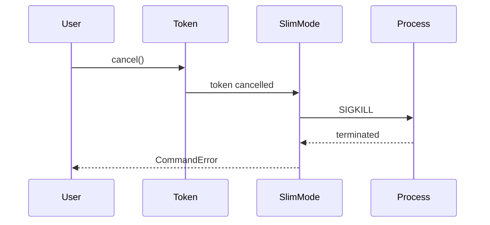
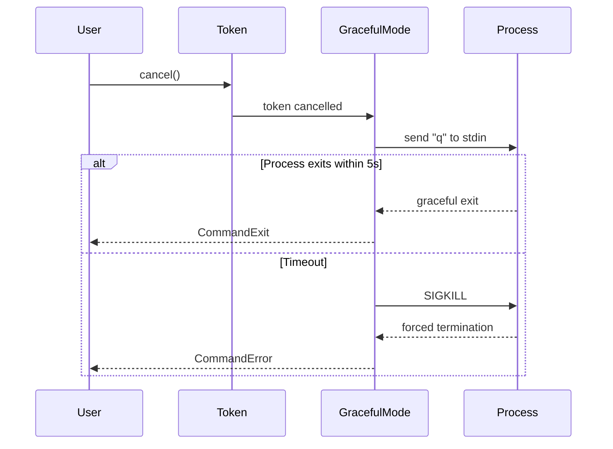

libffmpeg uses `tokio_util::sync::CancellationToken` to manage process lifecycle and enable cooperative cancellation across async tasks. All execution functions require a cancellation token.

## Overview

Cancellation tokens provide a way to signal that an operation should stop, allowing you to:

- Cancel long-running ffmpeg processes
- Implement timeouts
- Handle user-initiated stops (Ctrl+C)
- Coordinate shutdown across multiple tasks
- Build responsive applications

<Note>
All three execution modes ([`ffmpeg_slim`](/concepts/execution-modes#slim-mode), [`ffmpeg`](/concepts/execution-modes#standard-mode), and [`ffmpeg_graceful`](/concepts/execution-modes#graceful-mode)) require a `CancellationToken` parameter.
</Note>

## Basic Usage

### Creating a Token

```rust
use tokio_util::sync::CancellationToken;

let token = CancellationToken::new();
```

### Cancelling a Token

```rust
let token = CancellationToken::new();

// Cancel from another task
tokio::spawn(async move {
    tokio::time::sleep(Duration::from_secs(30)).await;
    token.cancel(); // Cancel after 30 seconds
});

let result = ffmpeg_slim(token, |cmd| {
    cmd.arg("-i").arg("input.mp4");
    cmd.arg("output.mp4");
}).await?;
```

### Child Tokens

Child tokens are automatically cancelled when their parent is cancelled:

```rust
let root_token = CancellationToken::new();
let child_token = root_token.child_token();

// Cancelling root_token also cancels child_token
root_token.cancel();
```

## Cancellation Behavior by Mode

Each execution mode handles cancellation differently:

### Slim Mode - Immediate Kill

From `~/workspace/source/libffmpeg/src/ffmpeg/slim.rs:33`:

```rust
libcmd::run(ffmpeg_path, None, cancellation_token.child_token(), prepare)
    .await
```

When the token is cancelled:
1. Process is immediately sent SIGKILL
2. No cleanup or finalization occurs
3. Output files may be incomplete or corrupted

### Standard Mode - Immediate Kill

From `~/workspace/source/libffmpeg/src/ffmpeg/standard.rs:35-40`:

```rust
libcmd::run(
    ffmpeg_path,
    Some(server.clone()),
    cancellation_token.child_token(),
    prepare,
)
```

Behavior is identical to slim mode:
1. Process receives SIGKILL immediately
2. Output monitoring stops
3. No graceful shutdown

### Graceful Mode - Stdin Quit with Fallback

From `~/workspace/source/libffmpeg/src/ffmpeg/graceful.rs:40-44`:

```rust
// Different source token for the process, lets us gracefully exit
let process_token = CancellationToken::new();

// Cancelled after the process exits
let exit_token = CancellationToken::new();
```

Graceful mode uses multiple tokens for sophisticated cancellation:

1. **User cancels** → Main cancellation token is cancelled
2. **Send "q" command** → `client.send("q")` to ffmpeg's stdin
3. **Wait up to 5 seconds** → Process should exit cleanly
4. **Fallback to SIGKILL** → If timeout expires, force kill

From `~/workspace/source/libffmpeg/src/ffmpeg/graceful.rs:58-84`:

```rust
let shutdown_handle = {
    let client = client.clone();
    let process_token = process_token.clone();
    let exit_token = exit_token.clone();
    let kill_token = cancellation_token.child_token();
    tokio::spawn(
        async move {
            // Wait for kill token to cancel (user requested cancellation)
            tokio::select! {
                () = exit_token.cancelled() => {
                    // if process exits before kill is requested, we don't want to kill the process
                    return
                },
                () = kill_token.cancelled() => {
                    // Continue killing the process
                }
            }

            // Send quit
            client.send("q").await;

            // Wait for exit to be cancelled (process exited), with max of 5 seconds
            match tokio::time::timeout(Duration::from_secs(5), exit_token.cancelled()).await {
                Ok(()) => {}
                Err(_timeout) => {
                    // Process didn't respond to quit command, tell the manager to kill the process
                    tracing::warn!(
                        "ffmpeg process did not respond to quit command, sending SIGKILL"
                    );
                    process_token.cancel();
                }
            }
        }
    )
};
```

<Tip>
Use graceful mode when you need output files to be properly finalized, even when cancelled. This ensures ffmpeg writes file headers, indexes, and metadata correctly.
</Tip>

## Common Patterns

### Signal Handling (Ctrl+C)

From `~/workspace/source/libffmpeg/examples/transcode_with_progress.rs:23-26`:

```rust
let root_token = CancellationToken::new();
let transcode_token = root_token.child_token();
let exit_token = root_token.child_token();
libsignal::cancel_after_signal(root_token.clone());
```

The `libsignal::cancel_after_signal` function (from the `libsignal` crate) automatically cancels the token when SIGINT (Ctrl+C) or SIGTERM is received.

<Note>
`libsignal` is not part of libffmpeg but is commonly used alongside it. Check your project dependencies for signal handling utilities.
</Note>

### Timeout Pattern

Cancel a task after a specific duration:

```rust
use tokio::time::{timeout, Duration};
use tokio_util::sync::CancellationToken;

let token = CancellationToken::new();
let token_clone = token.clone();

// Cancel after 5 minutes
tokio::spawn(async move {
    tokio::time::sleep(Duration::from_secs(300)).await;
    token_clone.cancel();
});

let result = ffmpeg_slim(token, |cmd| {
    cmd.arg("-i").arg("input.mp4");
    cmd.arg("-c:v").arg("libx264");
    cmd.arg("output.mp4");
}).await;

match result {
    Ok(_) => println!("Completed successfully"),
    Err(e) => eprintln!("Failed or cancelled: {}", e),
}
```

Or use tokio's `timeout` wrapper:

```rust
let token = CancellationToken::new();
let token_clone = token.clone();

let result = timeout(Duration::from_secs(300), async {
    ffmpeg_slim(token, |cmd| {
        cmd.arg("-i").arg("input.mp4");
        cmd.arg("-c:v").arg("libx264");
        cmd.arg("output.mp4");
    }).await
}).await;

match result {
    Ok(Ok(exit)) => println!("Completed: {:?}", exit),
    Ok(Err(e)) => eprintln!("ffmpeg error: {}", e),
    Err(_) => {
        token_clone.cancel(); // Cancel the token on timeout
        eprintln!("Operation timed out");
    }
}
```

### Multiple Tasks with Shared Cancellation

From `~/workspace/source/libffmpeg/examples/transcode_with_progress.rs:23-26,35-74`:

```rust
let root_token = CancellationToken::new();
let transcode_token = root_token.child_token();
let exit_token = root_token.child_token();
libsignal::cancel_after_signal(root_token.clone());

let monitor = libffmpeg::libcmd::CommandMonitor::with_capacity(100);

let monitor_fut = {
    let mut client = monitor.client.clone();
    let exit_token = exit_token.clone();
    tokio::spawn(async move {
        let mut progress = libffmpeg::ffmpeg::progress::PartialProgress::default();

        while let Some(Some(delivery)) =
            client.recv().with_cancellation_token(&exit_token).await
        {
            match delivery {
                libffmpeg::libcmd::CommandMonitorMessage::Stdout { line } => {
                    // Process output...
                }
                libffmpeg::libcmd::CommandMonitorMessage::Stderr { line } => {
                    eprintln!("[E] {}", line)
                }
            }
        }
    })
};

let result = ffmpeg(transcode_token, &monitor.server, |cmd| {
    // Configure command...
}).await?;

exit_token.cancel();

if let Err(e) = monitor_fut.await {
    eprintln!("Failed to wait for monitor: {}", e);
}
```

This pattern:
1. Creates a root token for overall coordination
2. Creates child tokens for specific tasks (transcoding, monitoring)
3. Cancels all children by cancelling the root
4. Explicitly cancels the monitor's exit token when transcoding completes

### User-Initiated Cancellation

```rust
use std::sync::Arc;
use tokio::sync::Mutex;
use tokio_util::sync::CancellationToken;

#[derive(Clone)]
struct TranscodeJob {
    token: CancellationToken,
}

impl TranscodeJob {
    fn new() -> Self {
        Self {
            token: CancellationToken::new(),
        }
    }

    async fn run(&self, input: &str, output: &str) -> Result<(), Box<dyn std::error::Error>> {
        let result = ffmpeg_graceful(
            self.token.clone(),
            &monitor.client,
            &monitor.server,
            |cmd| {
                cmd.arg("-i").arg(input);
                cmd.arg("-c:v").arg("libx264");
                cmd.arg(output);
            },
        ).await?;
        
        Ok(())
    }

    fn cancel(&self) {
        self.token.cancel();
    }
}

// Usage:
let job = TranscodeJob::new();
let job_clone = job.clone();

// Start transcoding in background
tokio::spawn(async move {
    if let Err(e) = job_clone.run("input.mp4", "output.mp4").await {
        eprintln!("Transcode failed: {}", e);
    }
});

// Cancel from UI or another task
job.cancel();
```

## Child Token Usage in libffmpeg

All execution functions create child tokens internally:

### Slim Mode

From `~/workspace/source/libffmpeg/src/ffmpeg/slim.rs:33`:

```rust
libcmd::run(ffmpeg_path, None, cancellation_token.child_token(), prepare)
```

### Standard Mode

From `~/workspace/source/libffmpeg/src/ffmpeg/standard.rs:38`:

```rust
cancellation_token.child_token(),
```

### Graceful Mode

From `~/workspace/source/libffmpeg/src/ffmpeg/graceful.rs:57,94`:

```rust
let kill_token = cancellation_token.child_token();
// ...
process_token.child_token(),
```

<Info>
By creating child tokens internally, libffmpeg ensures that cancelling your provided token will properly cancel all internal operations without affecting other operations that might share the same parent token.
</Info>

## Cancellation and Error Handling

When a cancellation occurs, the execution function returns a `CommandError` wrapped in `FfmpegError`:

```rust
use libffmpeg::ffmpeg::ffmpeg_slim;

let token = CancellationToken::new();
let token_clone = token.clone();

// Cancel after 1 second
tokio::spawn(async move {
    tokio::time::sleep(Duration::from_secs(1)).await;
    token_clone.cancel();
});

let result = ffmpeg_slim(token, |cmd| {
    cmd.arg("-i").arg("input.mp4");
    cmd.arg("-t").arg("3600"); // 1 hour encoding
    cmd.arg("output.mp4");
}).await;

match result {
    Ok(exit) => {
        println!("Completed: {:?}", exit);
    }
    Err(e) => {
        // May be a cancellation error
        eprintln!("Error: {}", e);
    }
}
```

From `~/workspace/source/libffmpeg/src/ffmpeg/slim.rs:38-43`:

```rust
.inspect_err(|e| {
    tracing::error!(
        error = %e,
        "ffmpeg execution failed"
    );
})
```

The error is logged with tracing, allowing you to diagnose whether the failure was due to cancellation or another issue.

## Best Practices

### ✅ Do

<Check>Always pass a cancellation token, even if you don't plan to cancel</Check>
<Check>Use child tokens to isolate cancellation scopes</Check>
<Check>Cancel tokens from a different task or signal handler</Check>
<Check>Clean up resources after cancellation</Check>
<Check>Use graceful mode when output file integrity matters</Check>

### ❌ Don't

<Warning>Don't reuse the same token for multiple independent operations</Warning>
<Warning>Don't cancel a token before calling the execution function</Warning>
<Warning>Don't assume cancellation is instant - processes may take time to stop</Warning>
<Warning>Don't forget to handle cancellation errors in your code</Warning>

## Cancellation Flow Diagram



For graceful mode:



## Testing Cancellation

Test cancellation behavior in your application:

```rust
#[tokio::test]
async fn test_cancellation() {
    let token = CancellationToken::new();
    let token_clone = token.clone();

    // Cancel after 100ms
    tokio::spawn(async move {
        tokio::time::sleep(Duration::from_millis(100)).await;
        token_clone.cancel();
    });

    let result = ffmpeg_slim(token, |cmd| {
        cmd.arg("-f").arg("lavfi");
        cmd.arg("-i").arg("testsrc=duration=60");
        cmd.arg("-f").arg("null");
        cmd.arg("-");
    }).await;

    // Should fail due to cancellation
    assert!(result.is_err());
}
```

## Related Topics

<CardGroup cols={2}>
  <Card title="Execution Modes" icon="play" href="/concepts/execution-modes">
    Learn how each mode handles cancellation
  </Card>
  <Card title="Monitoring" icon="chart-line" href="/concepts/monitoring">
    Coordinate cancellation with output monitoring
  </Card>
</CardGroup>
