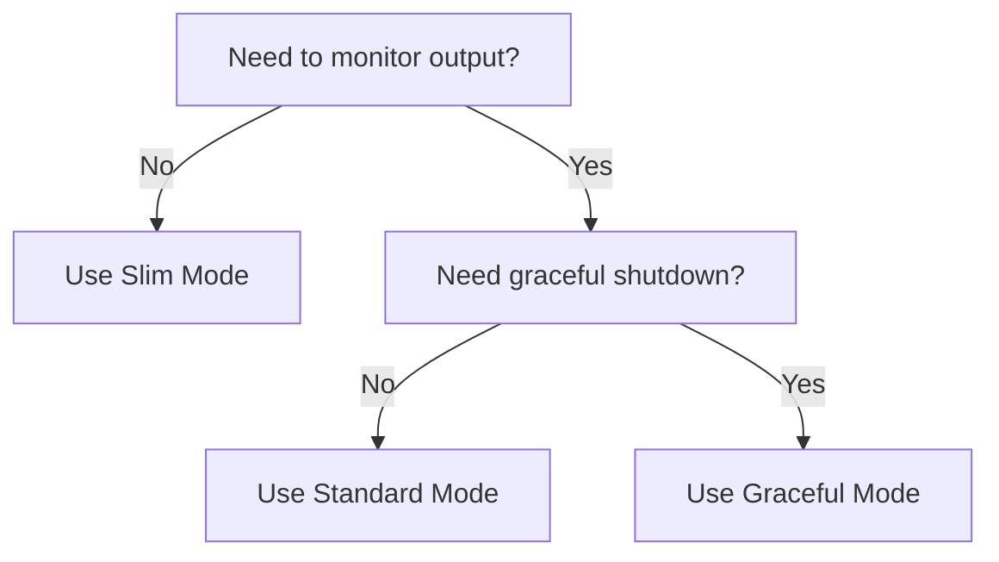

libffmpeg provides three execution modes for running ffmpeg, each designed for different use cases ranging from lightweight execution to graceful shutdown with output monitoring.

## Overview

The three execution modes are:

- **Slim** - Lightweight execution with cancellation support only
- **Standard** - Standard execution with output monitoring
- **Graceful** - Full-featured execution with graceful shutdown and output monitoring

<CardGroup cols={3}>
  <Card title="Slim" icon="bolt" href="#slim-mode">
    Minimal overhead, basic cancellation
  </Card>
  <Card title="Standard" icon="terminal" href="#standard-mode">
    Output monitoring for progress tracking
  </Card>
  <Card title="Graceful" icon="hand" href="#graceful-mode">
    Graceful shutdown with stdin quit command
  </Card>
</CardGroup>

## Slim Mode

The slim mode is the lightest-weight variant that spawns ffmpeg, waits for it to complete, and returns the exit result. Use this when you don't need to monitor output or implement graceful shutdown.

### Function Signature

```rust ~/workspace/source/libffmpeg/src/ffmpeg/slim.rs
pub async fn ffmpeg_slim<Prepare>(
    cancellation_token: CancellationToken,
    prepare: Prepare,
) -> Result<CommandExit, FfmpegError>
where
    Prepare: FnOnce(&mut Command),
```

### Key Characteristics

- **No output monitoring** - stdout/stderr are not captured or streamed
- **Basic cancellation** - Process is killed immediately when token is cancelled
- **Minimal overhead** - Fastest execution with lowest resource usage
- **Simple interface** - Only requires a cancellation token and prepare function

### When to Use

<Check>Simple batch processing where progress tracking isn't needed</Check>
<Check>Fire-and-forget ffmpeg operations</Check>
<Check>Maximum performance with minimal overhead</Check>

### Example Usage

```rust
use libffmpeg::ffmpeg::ffmpeg_slim;
use tokio_util::sync::CancellationToken;

let token = CancellationToken::new();

let result = ffmpeg_slim(token, |cmd| {
    cmd.arg("-i").arg("input.mp4");
    cmd.arg("-c:v").arg("libx264");
    cmd.arg("-preset").arg("fast");
    cmd.arg("output.mp4");
}).await?;

if result.exit_code.as_ref().map(|e| e.success).unwrap_or(false) {
    println!("Encoding completed successfully");
}
```

### Implementation Details

From `~/workspace/source/libffmpeg/src/ffmpeg/slim.rs:24-34`:

```rust
let ffmpeg_path = find_ffmpeg().ok_or(FfmpegError::NotFound).inspect_err(
    |e| tracing::error!(error =% e, error_context =? e, "ffmpeg binary not found"),
)?;

tracing::info!(
    ffmpeg_path = %ffmpeg_path.display(),
    "Executing ffmpeg"
);

libcmd::run(ffmpeg_path, None, cancellation_token.child_token(), prepare)
    .await
```

Note that `None` is passed for the monitor server parameter, meaning no output monitoring occurs.

## Standard Mode

The standard mode adds output monitoring capabilities, allowing you to stream stdout and stderr lines through a `CommandMonitorServer`. This is ideal for progress tracking and real-time logging.

### Function Signature

```rust ~/workspace/source/libffmpeg/src/ffmpeg/standard.rs
pub async fn ffmpeg<Prepare>(
    cancellation_token: CancellationToken,
    server: &CommandMonitorServer,
    prepare: Prepare,
) -> Result<CommandExit, FfmpegError>
where
    Prepare: FnOnce(&mut Command),
```

### Key Characteristics

- **Output monitoring** - stdout/stderr lines are streamed through the monitor
- **Progress parsing** - Can parse ffmpeg's `-progress pipe:1` output
- **Immediate cancellation** - Process is killed immediately on cancellation (no graceful shutdown)
- **Real-time feedback** - Monitor output as the process runs

### When to Use

<Check>Need to track encoding progress in real-time</Check>
<Check>Want to log or display ffmpeg output to users</Check>
<Check>Parse progress data for UI updates</Check>
<Check>Don't require graceful shutdown behavior</Check>

### Example Usage

From `~/workspace/source/libffmpeg/examples/transcode_with_progress.rs:76-88`:

```rust
let monitor = libffmpeg::libcmd::CommandMonitor::with_capacity(100);

let result = ffmpeg(transcode_token, &monitor.server, |cmd| {
    cmd.arg("-i").arg(&args.input);
    cmd.arg("-t").arg(total.to_string());
    cmd.arg("-c:v").arg("libx264");
    cmd.arg("-preset").arg("fast");
    cmd.arg("-crf").arg("23");
    cmd.arg("-c:a").arg("aac");
    cmd.arg("-b:a").arg("128k");
    cmd.arg("-progress").arg("pipe:1");
    cmd.arg("-y");
    cmd.arg(&args.output);
}).await?;
```

### Implementation Details

From `~/workspace/source/libffmpeg/src/ffmpeg/standard.rs:35-40`:

```rust
libcmd::run(
    ffmpeg_path,
    Some(server.clone()),
    cancellation_token.child_token(),
    prepare,
)
```

The key difference from slim mode is passing `Some(server.clone())` instead of `None` for output monitoring.

## Graceful Mode

The graceful mode provides the most sophisticated execution behavior, combining output monitoring with graceful shutdown. When cancelled, it sends the `q` command to ffmpeg's stdin, allowing ffmpeg to finalize the output file properly before exiting.

### Function Signature

```rust ~/workspace/source/libffmpeg/src/ffmpeg/graceful.rs
pub async fn ffmpeg_graceful<Prepare>(
    cancellation_token: CancellationToken,
    client: &CommandMonitorClient,
    server: &CommandMonitorServer,
    prepare: Prepare,
) -> Result<CommandExit, FfmpegError>
where
    Prepare: FnOnce(&mut Command),
```

### Key Characteristics

- **Graceful shutdown** - Sends `q` to stdin on cancellation
- **5-second timeout** - Falls back to SIGKILL if process doesn't exit cleanly
- **Output monitoring** - Full stdout/stderr streaming support
- **Proper finalization** - Allows ffmpeg to close files and write metadata

### When to Use

<Check>Need to ensure output files are properly finalized</Check>
<Check>Want to avoid corrupted output on cancellation</Check>
<Check>Require both progress tracking and clean shutdown</Check>
<Check>Building user-facing applications with stop/cancel functionality</Check>

### Shutdown Flow

From `~/workspace/source/libffmpeg/src/ffmpeg/graceful.rs:45-51`:

```rust
// Flow:
//  1. If the process exits naturally before cancellation, do nothing and return early
//  2. User requests cancellation
//  3. Send "q" to ffmpeg's stdin
//  4. Give the process a max of 5 seconds to exit
//  5. If the process doesn't exit after 5 seconds, cancel the process' token, signals that it should send SIGKILL
//  6. The process will be killed, as if none of this was ever here
```

### Example Usage

```rust
use libffmpeg::ffmpeg::ffmpeg_graceful;
use libffmpeg::libcmd::CommandMonitor;
use tokio_util::sync::CancellationToken;

let token = CancellationToken::new();
let monitor = CommandMonitor::with_capacity(100);

let result = ffmpeg_graceful(
    token,
    &monitor.client,
    &monitor.server,
    |cmd| {
        cmd.arg("-i").arg("input.mp4");
        cmd.arg("-c:v").arg("libx264");
        cmd.arg("-preset").arg("slow");
        cmd.arg("-crf").arg("18");
        cmd.arg("output.mp4");
    }
).await?;
```

### Implementation Details

The graceful mode uses a separate `process_token` and `exit_token` to coordinate shutdown:

From `~/workspace/source/libffmpeg/src/ffmpeg/graceful.rs:40-44`:

```rust
// Different source token for the process, lets us gracefully exit
let process_token = CancellationToken::new();

// Cancelled after the process exits
let exit_token = CancellationToken::new();
```

#### Shutdown Handler

From `~/workspace/source/libffmpeg/src/ffmpeg/graceful.rs:58-88`:

```rust
let shutdown_handle = {
    let client = client.clone();
    let process_token = process_token.clone();
    let exit_token = exit_token.clone();
    let kill_token = cancellation_token.child_token();
    tokio::spawn(
        async move {
            // Wait for kill token to cancel (user requested cancellation)
            tokio::select! {
                () = exit_token.cancelled() => {
                    // if process exits before kill is requested, we don't want to kill the process
                    return
                },
                () = kill_token.cancelled() => {
                    // Continue killing the process
                }
            }

            // Send quit
            client.send("q").await;

            // Wait for exit to be cancelled (process exited), with max of 5 seconds
            match tokio::time::timeout(Duration::from_secs(5), exit_token.cancelled()).await {
                Ok(()) => {}
                Err(_timeout) => {
                    // Process didn't respond to quit command, tell the manager to kill the process
                    tracing::warn!(
                        "ffmpeg process did not respond to quit command, sending SIGKILL"
                    );
                    process_token.cancel();
                }
            }
        }
    )
};
```

<Note>
The 5-second timeout is hardcoded in the implementation. If ffmpeg doesn't respond to the `q` command within this window, it will be forcefully killed with SIGKILL.
</Note>

## Comparison Table

| Feature | Slim | Standard | Graceful |
|---------|------|----------|----------|
| Output Monitoring | ❌ | ✅ | ✅ |
| Progress Tracking | ❌ | ✅ | ✅ |
| Graceful Shutdown | ❌ | ❌ | ✅ |
| SIGKILL Fallback | Immediate | Immediate | After 5s |
| Monitor Client Required | ❌ | ❌ | ✅ |
| Monitor Server Required | ❌ | ✅ | ✅ |
| Resource Usage | Lowest | Medium | Highest |

## Choosing the Right Mode

Use this decision tree to select the appropriate execution mode:



<Tip>
All three modes use the same `find_ffmpeg()` function for binary discovery and share the same error handling patterns. You can easily switch between modes by changing the function call without restructuring your code.
</Tip>

## Related Topics

<CardGroup cols={2}>
  <Card title="Binary Discovery" icon="magnifying-glass" href="/concepts/binary-discovery">
    Learn how ffmpeg binaries are located
  </Card>
  <Card title="Cancellation" icon="circle-stop" href="/concepts/cancellation">
    Understand CancellationToken usage patterns
  </Card>
  <Card title="Monitoring" icon="chart-line" href="/concepts/monitoring">
    Deep dive into CommandMonitor usage
  </Card>
</CardGroup>
